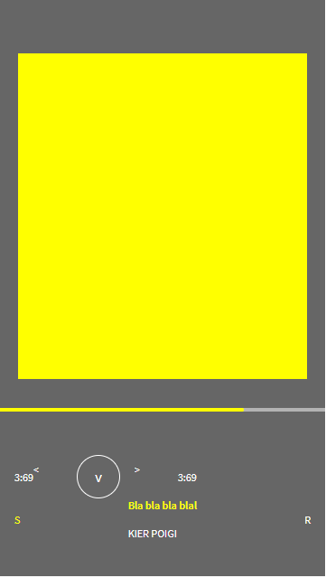
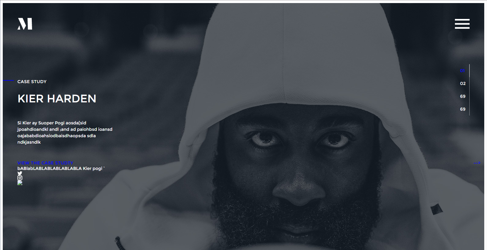
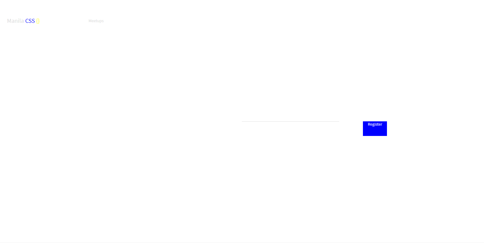

## Code In The Dark - February 2018

Thank you, ManilaCSS. It was a cool experience.

## Challenge 1
I forgot about the assets. 1420 Combo.

## Challenge 2
It worked, ahuh.

## Challenge 3
The circles didn't come out, and I forgot about `display: inline-block`.

